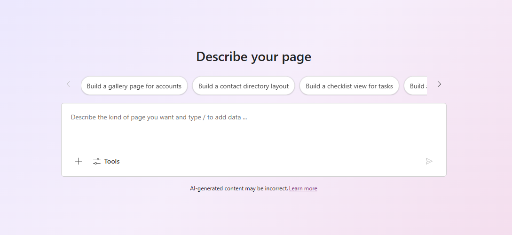
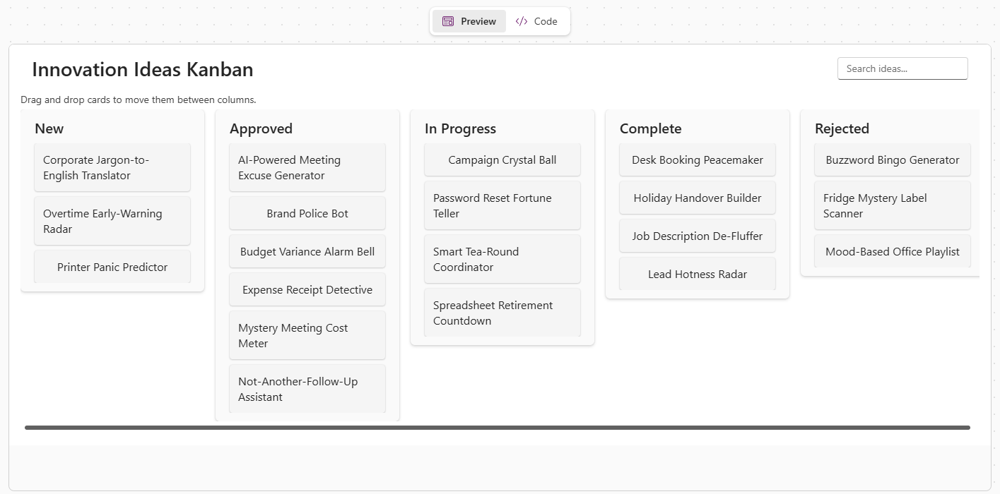
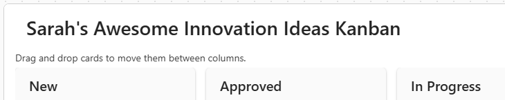
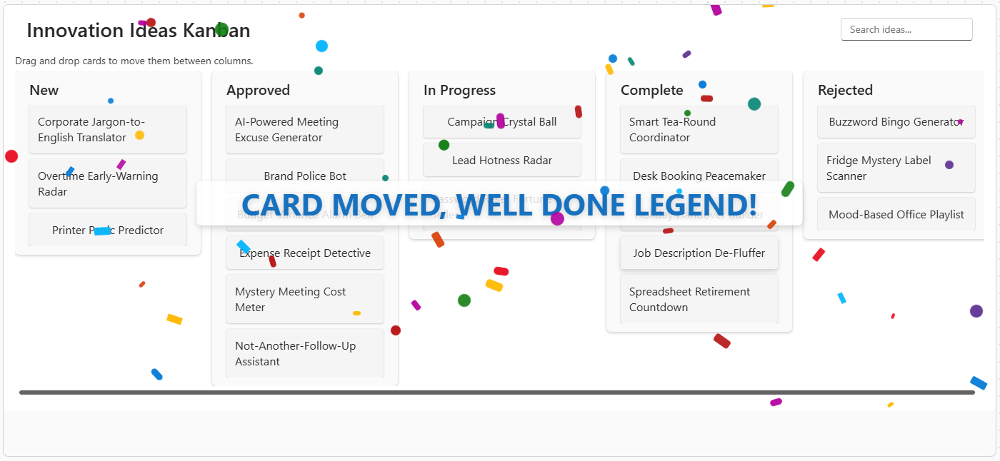
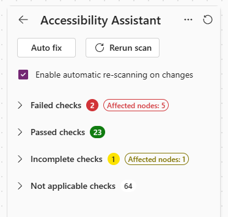

# Lab 1 - Generative Pages

## Setup

Navigate to https://make.powerapps.com/, select the environment in the top-right which matches your username, e.g. User01.

Set *Future Is Now Workshop* as your [preferred solution](https://learn.microsoft.com/en-us/power-apps/maker/data-platform/preferred-solution#set-your-preferred-solution) to ensure your work is saved into that solution by default.

If you get stuck on anything, ask others at your table for help. If you still need help, ask Keith or any of the helpers.

To see an example of this lab, open the *Future Is Now Workshop - Examples* solution and edit the *Innovation Ideas Example App*.

> [!IMPORTANT]
> AI can get things wrong (and often does!). If it does, reword your prompt to address where it has gone wrong and try again.

## Getting started

1. Let's open our pre-built solution. Navigate to https://make.powerapps.com/, Solutions, *Future Is Now Workshop*, Objects.

1. We have a Dataverse table containing innovation ideas ready to use. Select Tables. For the *Innovation Idea* table, select the 3-dots button, Edit, Edit in new tab.

1. Hide all columns then show only the following:
    - Name
    - Description
    - Department
    - Business Impact
    - Delivery Effort
    - Estimated Benefit

1. This table lists silly ideas like *Buzzword Bingo Generator*, *AI-Powered Meeting Excuse Generator*, and *Expense Receipt Detective*. We'll use this table in our app.

1. We also have a model-driven app using this table. Return to the browser tab listing the solution objects, select Apps. For the *Innovation Ideas App*, select the 3-dots button, Edit, Edit in new tab.

1. Preview the app. Notice how it currently only has one page for the *Innovation Ideas* table.

1. Let's take a look at how to create a Generative Page. Return to the browser tab showing the app designer. Select Add page near the top-left, Generative page, Describe a new page. You should see a page like this:

    

1. Let's check out the options:

    - Prompt box: The main input box which currently contains placeholder text "Describe the kind of page you want and type / to add data ..."
    - Suggested prompts: Above the prompt box, we have suggested prompts to help us get started. Select one of these to see it copied into the prompt box then read the full prompt to see how descriptive it is. When done, clear the prompt box and remove any tables it lists at the bottom of the prompt box.
    - +, Attach images: At the bottom-left of the prompt box, select the + button to see the Attach images option. This option allows us to upload images containing the structure or layout of what we want to create.
    - +, Add table: At the bottom-left of the prompt box, select the + button to see the Add table option. This option allows us to reference Dataverse tables for use in the generative page.
    - Tools, Include images: At the bottom-left of the prompt box, select the Tools button to see the Include images toggle. Toggling this on allows the agent to access images from a library of 25,000 stock images for things like placeholder images and decorative backgrounds.

## Your first prompt

1. Copy the following prompt into the prompt box:

    ```
    Create a Kanban board of Innovation Ideas. Each card should show the idea Name only. Each column should represent the Idea Status.
    ```

1. In the bottom-right, select +, Add table, select *Innovation Idea*.

1. Select the Generate button in the bottom-right of the prompt box. The App Agent will begin work, it may take a while to complete.

1. Notice that something called the *App Agent* plans and generates a page which may look like this. Congratulations, you have published a Generative Page! 🎉

    

    > [!NOTE]
    > If the page doesn't look right, don't worry, we'll try to fix it later.

1. Save your changes often using the save button in the top-right of the screen.

## Let's look at what happened

1. The *'*Describe your page*'* prompt experience has moved to a pane on the left side, with the generated page displayed to the right of it.

1. In the prompt pane, you should see your prompt followed by the *App Agent* results. Expand *Agent Thoughts* and read through the steps.

1. Now expand *Summary* and read through it.

1. On the right, the *Preview* tab shows the page.

1. Select the *Code* tab to view the React page code created. Try reading through it even if you don't understand the code to see if you recognise anything, some examples:

    - `import React, { useEffect, useState } from "react";` - Provides the core React library.
    - `"en-US"` - Uses US-English.
    - `const result = await dataApi.queryTable("ka_innovationidea" ...` - Reads data from the Innovation Idea table.

1. Select the *Preview* tab to return to the page preview.

## Do we need to fix anything with the page?

1. Again, AI can (often) get things wrong. If it does, that's expected and ok, we can try and fix it. For example, if the agent generated the page but the cards do not contain the idea Name, try a prompt to fix it, for example:
    
    ```
    Display the idea Name on each card.
    ```

1. You may need one or more prompts to fix problems.

## Let's add a new feature

1. Try dragging and dropping cards, it probably does not work yet. If not, let's add the feature!

    ```
    Allow dragging and dropping of cards.
    ```

1. Notice the same process as before; the *App Agent* generates a page. Try it out to see if you can now drag and drop cards.

    > [!NOTE]
    > Again, if the feature does not work as expected then AI has missed something. Try rewording the prompt to address any issues.

## Let's change the code manually

1. Generative Pages are great because we can change the code manually if we wish. If you are not a coder, don't worry, we'll walk through this together 🙌

1. Select the *Preview* tab, check if your page contains a title, for example: "Innovation Ideas Kanban".
    
1. Select the *Code* tab, Edit, Ctrl+F to search for the title (for example, "Innovation Ideas Kanban"), change the text to include your name, for example: "Sarah's Awesome Innovation Ideas Kanban".

1. Select Save. The *App Agent* works away then flips to the Preview tab, and we should now see our title changed:

    

## Let's undo changes

1. Let's be honest with each other, that last change was silly and not something we want to keep 🤭 Let's undo it.

1. In the prompt pane, select Undo, the *App Agent* works away, then the page preview shows the page we had before with the sensible page title, for example: "Innovation Ideas Kanban".

## Let's add another new feature

1. By now, you have probably noticed that I like silliness and mischief 😜 If you like that too, you're going to love this...

1. Try this prompt:

    ```
    When I drop a card, show a large confetti animations with the message "CARD MOVED, WELL DONE LEGEND!"
    ```
    
1. Test it by dragging and dropping a card. Yeah, that's what I'm talking about!

    

## Let's check the accessibility

1. Accessibility is super important. Select the *Accessibility* button at the bottom-left of the page preview to view the *Accessibility Assistant*, you may see something like this:

    

1. Expand Failed checks. If there are any, they may sound quite techie, like "landmark-banner-is-top-level", etc. Keep a note of how many Failed checks are showing.

1. Well, not everyone is a pro-dev so we'll use the easy option and select *Auto fix*, the *App Agent* then works on fixing the issues.

1. After the page is updated, select the *Accessibility* button again, now check if the Failed checks has reduced. In my experience, sometimes failed checks have been fixed, sometimes there has been no improvement 🤷

## BONUS

You've finished already? You must be a rockstar! Change this page using more prompts or generate a new page. Go crazy, add anything you want, see what you can create 🚀

[Return to home](/README.md)
