# Lab 2 - Vibe Experience

## Setup

If you get stuck on anything, ask others at your table for help. If you still need help, ask Keith or any of the helpers.

To see an example of this lab after you've finished, download the [TricityTourPlatform.zip](./assets/TricityTourPlatform.zip) project and import it by selecting +, Upload project, select the zip file.

> [!IMPORTANT]
> AI can get things wrong (and often does!). If it does, reword your prompt to address where it has gone wrong and try again.

## Getting started

1. Navigate to https://make.powerapps.com/, you may see an option like this:

    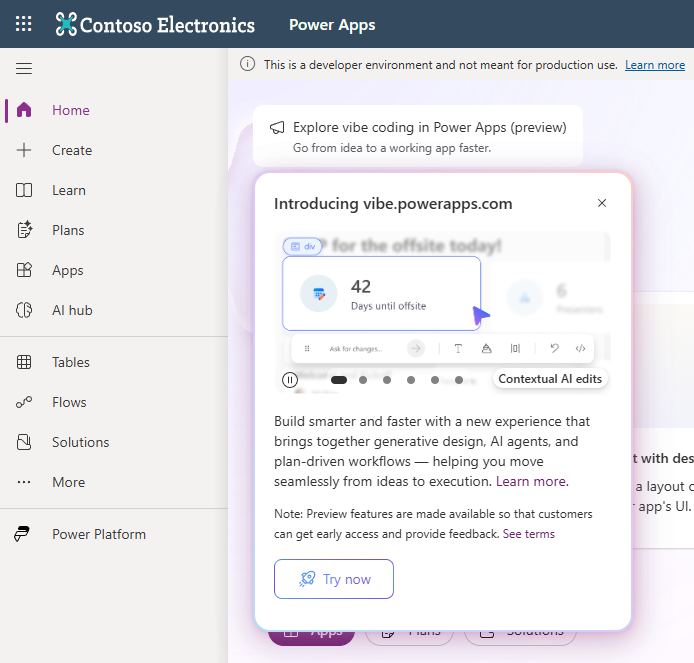

1. If so, hover over then select *Try now*.

1. If you don't see that option, navigate directly to https://vibe.powerapps.com/

1. You should see something like this:

    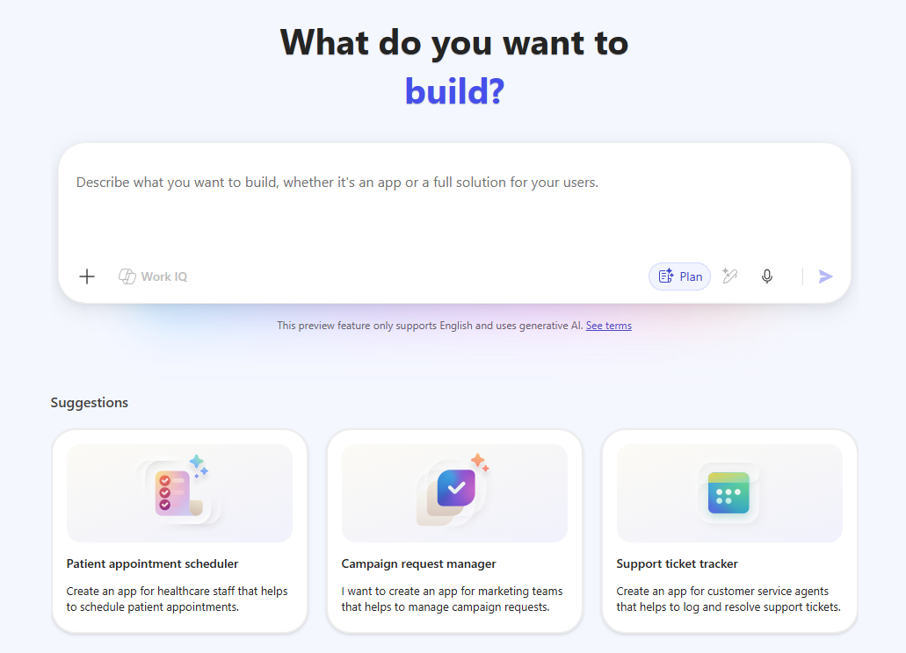

1. Select the environment in the bottom-left which matches your username. For example, User01:

    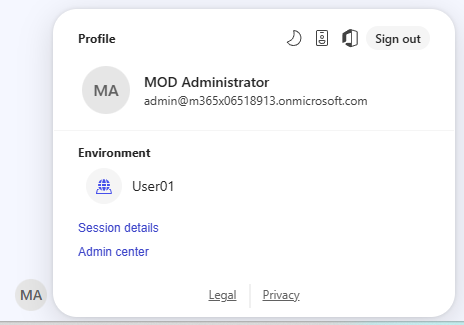

1. Let's check out some of the options:

    - Prompt box: The main input box which currently contains placeholder text "Describe what you want to build, whether it's an app or a full solution for your users."
    - Suggested prompts: Below the prompt box, we have suggested prompts to help us get started. Select one of these to see it copied into the prompt box then read the full prompt to see how descriptive it is. When done, clear the prompt box.
    - +, Add work content (disabled, requires extra licence): Upload Word/Excel files, emails, and chats to give more business context.
    - Upload images: Upload wireframes, screenshots, branding examples, etc to help build the UI, 2 MB max per image file.
    - +, Upload project: Upload a zip file of a Vibe or React project source code as a starting point.
    - Plan: Use this to create a plan before building.
    - Enhance prompt: We'll use this in a moment...
    - Start dictation: Why type when you can speak your prompt!

## Your first prompt

1. Enter the following prompt:

    ```
    Create an app to manage sightseeing tours in Gdynia and the Tricity area.
    ```

1. Ensure *Plan* is selected, it will be highlighted in blue.

1. Select *Enhance prompt*, this may take a moment. Review the enhanced prompt. Make other manual changes if you wish, otherwise leave the enhanced prompt as-is.

1. Select the *Submit your project description* button in the bottom-right of the prompt box.

## Work on the plan

1. You may be prompted with several multiple choice questions to create your plan. For example, I was asked these questions:

    - Initial scope - Which experience should the first version prioritize?
    - Integration depth - How should maps, payments, and notifications be represented in this build?
    - Payment model - Which booking payment model should the plan use?
    - Tour data - What should be the source of tours, schedules, bookings, guides, vehicles, and reviews?

1. Answer your questions using your best judgement, some tips:

    - If you're asked the question about whether to create a new data model vs use existing tables, select create a new data model.
    - If you don't have strong feelings, go with *Recommended* choices.
    - Select *Next* each time.
    
1.  If you are shown a summary of your answers, select *Submit responses*. The agent will then create the plan, it may take some time.

1. When the plan has been created, read through it. Take time to review the sections which may include Product, Roles, Navigation, Data entities, etc.

1. You may be asked to *Accept plan and create app* or *Keep editing and refine the plan*. If you want to make changes then select *Keep editing and refine the plan*, otherwise select *Accept plan and create app* then select *Submit*.

## App creation

1. The chat experience should now move to a pane on the left while the app is being created to the right of it (just like Generative Pages does).

1. Notice that the prompt "Implement this plan" has been automatically added to the chat after we selected *Submit*.

1. You can see *Task in progress* with a list of items being worked on, green ticks are applied when each item is complete ✅✅✅

1. App creation will likely take some time, feel free to take a break, grab a drink, etc ☕

1. When the app has been created, you may see something like this. Congratulations, you have created a Vibe Experience app! 🎉

    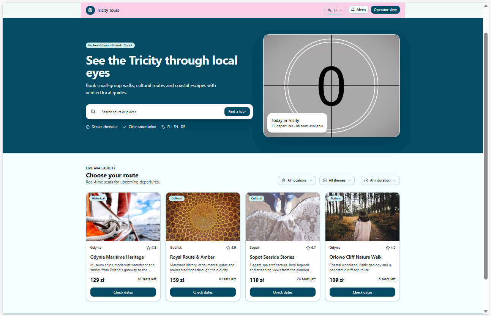

1. Save your changes often using the *Publish* button in the top-right of the screen. Leave *Data environment* set to *Draft* and select *Publish*. When it says *Publish complete!*, select the *x* to close the message:

    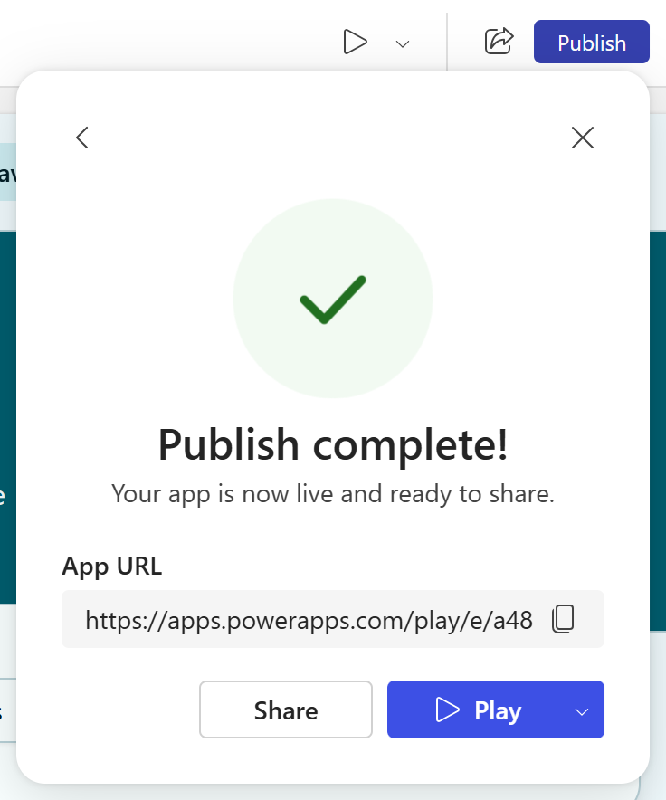

1. Congratulations, you have now published a Vibe Experience app!

## Review the created app

1. Ok, we now have an app, let's check it out! Try some of the app features, for example:

    - Search for tours
    - Filtering and sorting
    - Place bookings
    - Flip between views such as *Traveler*, *Operator*, and *Admin*

1. If anything does not work, make a note of it and we'll try to fix it later.

## Review the plan

1. At the top, select the *Plan* tab to view the plan:

    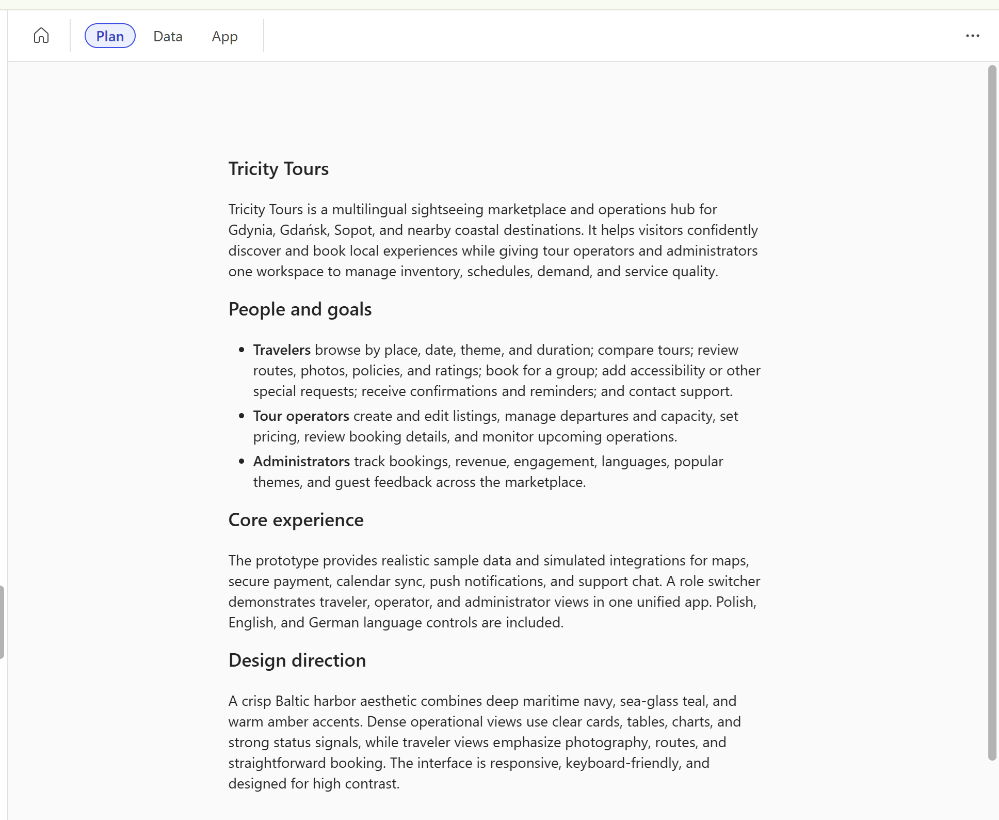

## Review the data

1. At the top, select the *Data* tab, review the data model and how the tables are related:

    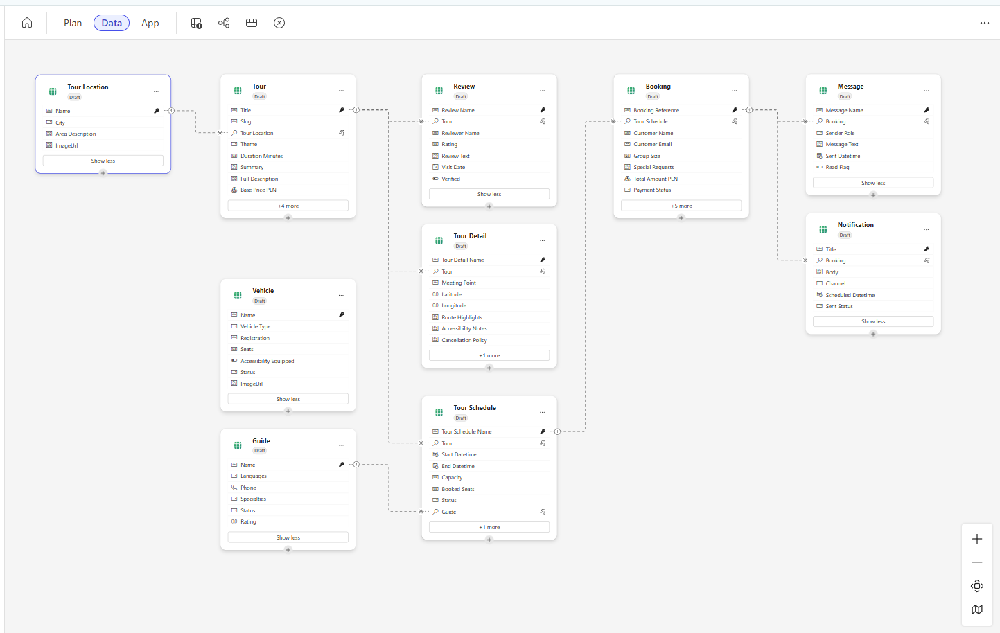

1. Notice the options at the top to add new tables, and create relationships.

1. Select one of the tables. Notice another option at the top to *View data*, select it. We now see a panel at the bottom containing dummy data. Notice how we have options to create a new row, delete rows, create new columns, etc.

    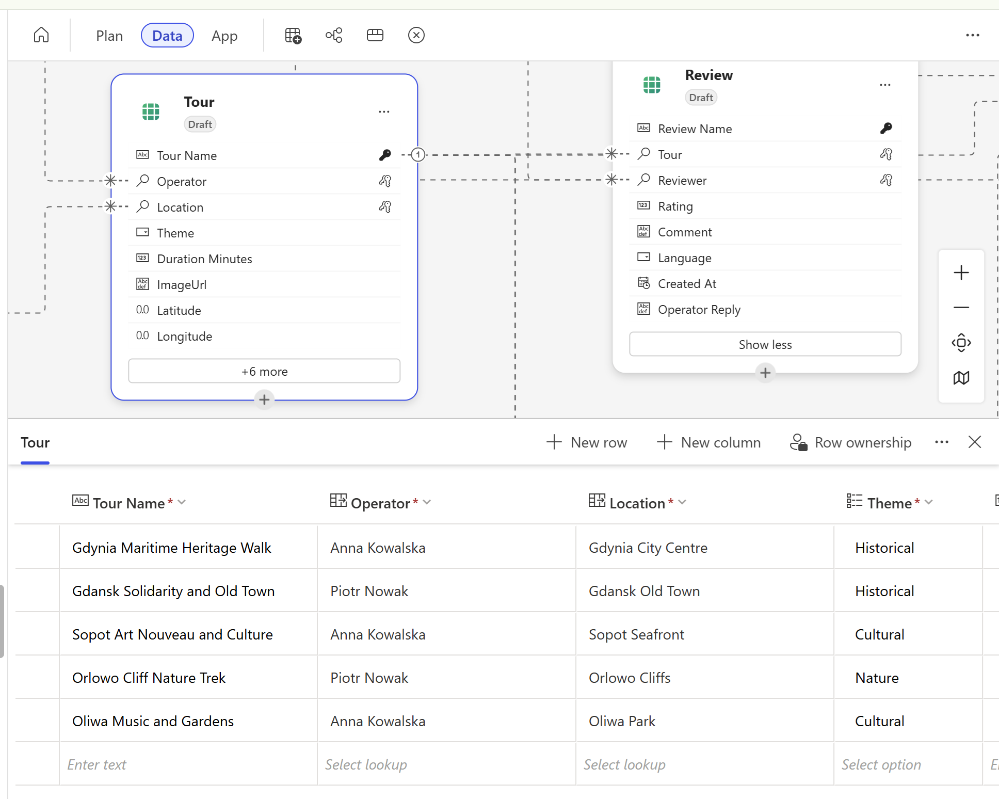

## Review the app code

1. At the top, select the *App* tab to return to the app preview. To the right of the tab, select the *Code* view and notice how we have a structure of folders and files like this:

    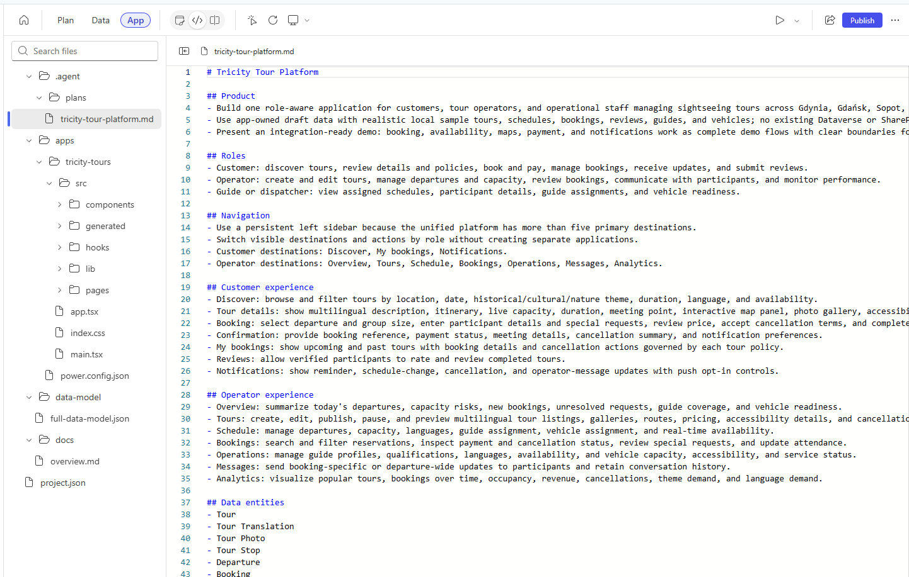

1. A brief walkthrough of these folders and files (yours may be different):
        
    - `\.agent\plans\tricity-tour-platform.md`: The plan in Markdown format.
    - `\apps\tricity-tours\src`: App source code.
    - `\data-model\full-data-model.json`: The data model configuration in JSON format.
    - `\docs\overview.md`: An overview of the solution in Markdown format.

1. Notice that the code view is read-only, code cannot be changed.

## Making manual changes

1. To the right of the *App* tab at the top, select *Preview* mode to return to the app preview.

1. To the right of the *Preview/Code/Split* options, select *Toggle inline edits*, then move your cursor over the app screen and notice how a selection box surrounds different sections.

1. Select a title or heading containing text. A popup appears with a prompt box and options for *Typography*, *Color*, and *Go to code*.

1. Enter the following prompt then select the *Send message* button:

    ```
    Change the text to end with "!!".
    ```
    
1. We see our prompt entered into the left chat pane then the agent works away. After a while, the change should be made:

    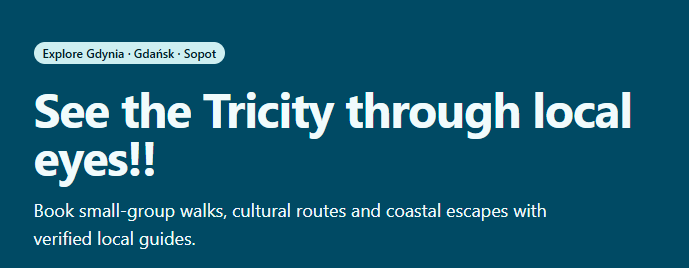

1. In the chat pane, expand *Task completed* to view the tasks performed.

1. At the top, select *Toggle inline edits* again, and select a different element such as a container. In the popup, select *Color*, *Background color*, *Library*, search for *pink-300*, notice how the colour has changed. Looking good! 👌

## Let's add a new feature

1. In the left chat pane, enter this prompt (leave the *Plan* button unselected):

    ```
    Add a section at the top of the main page to promote current price deals.
    ```
    
1. Your page may be updated like this:

    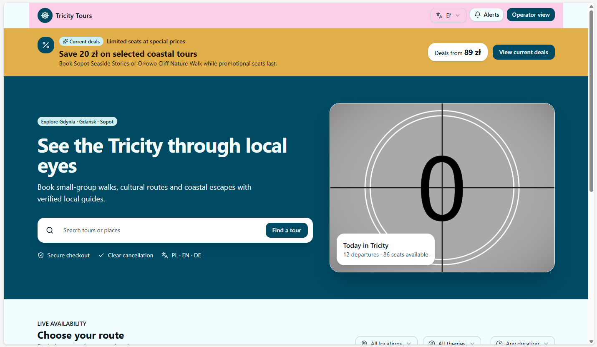

## BONUS

Job done? Legendary work! Change this page using more prompts, see if you can add something unusual like charts, maps or animations 💥

[Return to home](/README.md)
