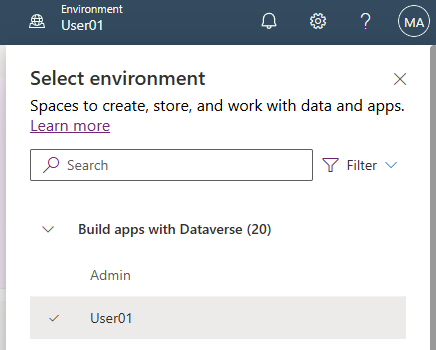
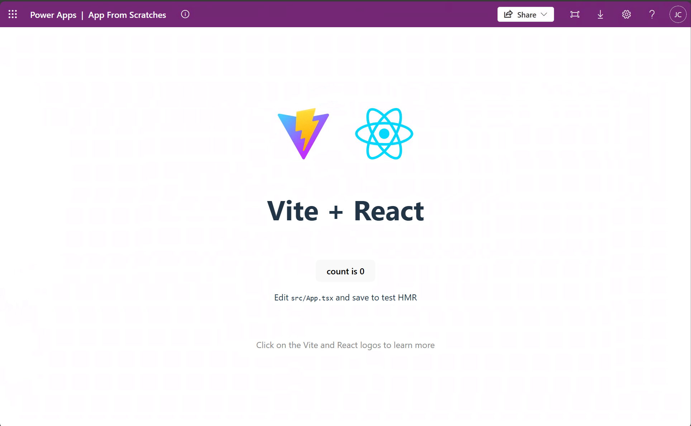
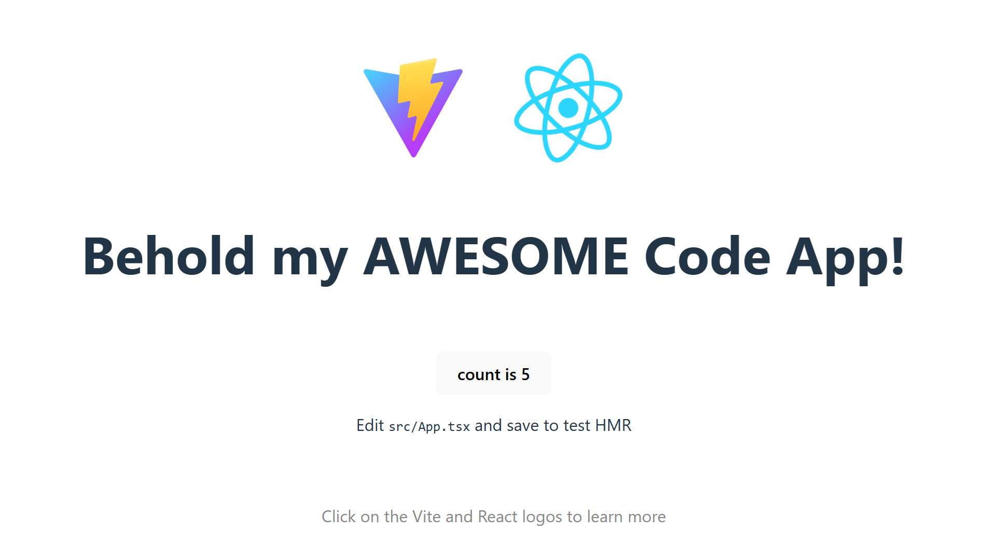
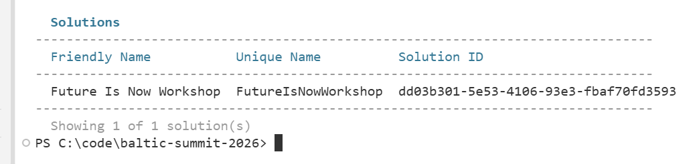
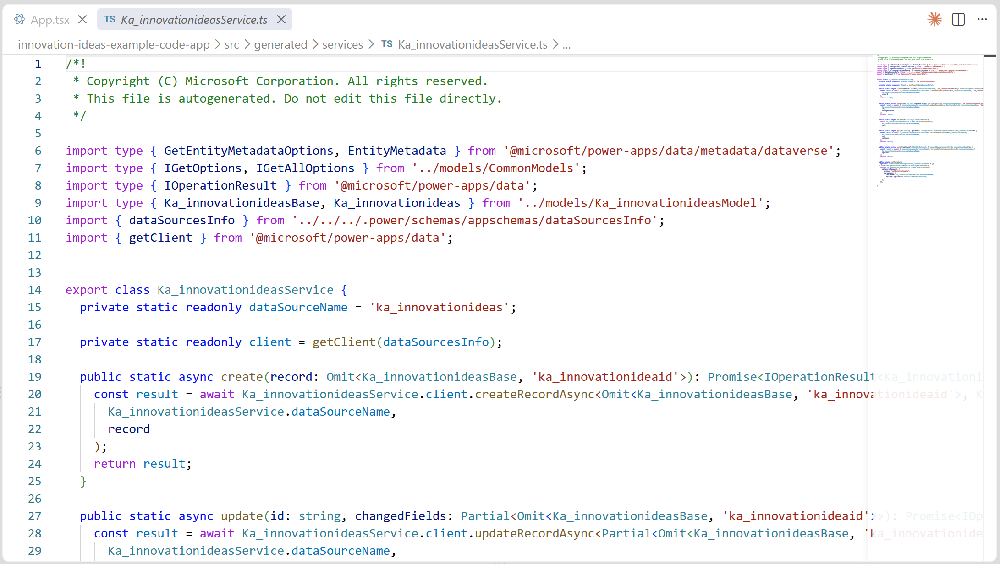
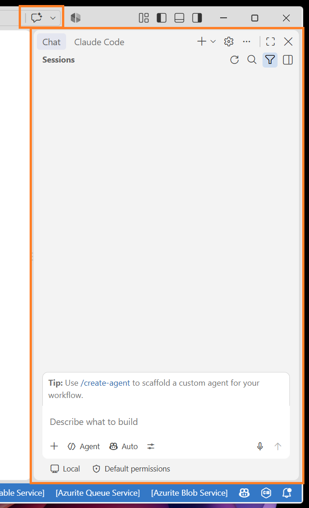
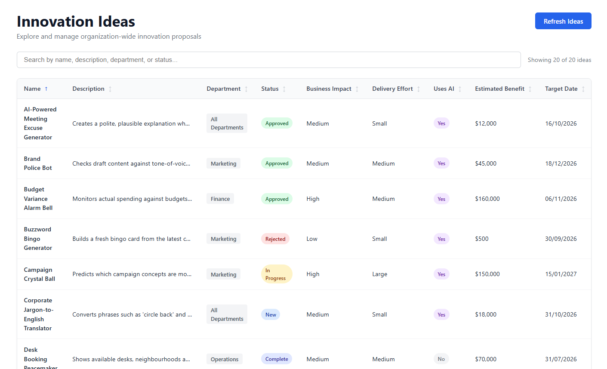
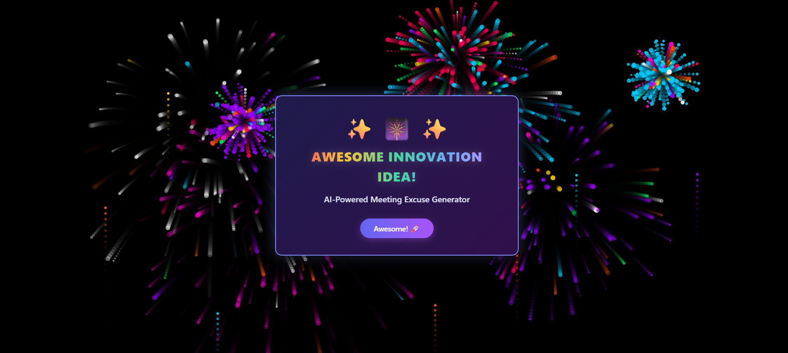

# Lab 3 - Code Apps

## Setup

Navigate to https://make.powerapps.com/, select the environment in the top-right which matches your username. For example, User01:



Set *Future Is Now Workshop* as your [preferred solution](https://learn.microsoft.com/en-us/power-apps/maker/data-platform/preferred-solution#set-your-preferred-solution) to ensure your work is saved into that solution by default.

If you get stuck on anything, ask others at your table for help. If you still need help, ask Keith or any of the helpers.

To see an example of this lab after you've finished, open the *Future Is Now Workshop - Examples* solution and edit the *Innovation Ideas Example Code App*.

> [!IMPORTANT]
> AI can get things wrong (and often does!). If it does, reword your prompt to address where it has gone wrong and try again.

Remember all that software you had to install for the prerequisites? It's all for this module to allow us to develop software locally on our laptops.

> [!NOTE]
> Code Apps requires use of development tools and running scripts, it's not for everyone.
>
> If you're not comfortable with Code Apps and would prefer to try something more low-code, check out *Plans*.
>
> *Plans* use AI to create an entire solution which can include Dataverse tables, canvas apps, model-driven apps, Power Pages sites, Power Automate flows, and Copilot Studio agents (it's actually very cool).
>
> Learn more here: https://learn.microsoft.com/en-us/power-apps/maker/plan-designer/plan-designer

## Getting started

1. Create a folder on youe laptop to save your code, for example: C:\code

1. Open Visual Studio Code, File menu, Open Folder, C:\code

1. Terminal menu, New Terminal. We're going to run some scripts in terminal but it's not that scary, promise! Let's walk through it together step by step...

1. Run this to take a copy of the Microsoft Code App template, place it in a new folder called *innovation-ideas-code-app*. Comfirm all prompts to install packages:

    ```
    npx degit github:microsoft/PowerAppsCodeApps/templates/vite innovation-ideas-code-app
    ```

    - If you get this error...
    
        ```
        npx : File C:\Program Files\nodejs\npx.ps1 cannot be loaded because running scripts is disabled on this system
        ```

    - ...then run this to permanently allows locally created scripts to run, while still requiring downloaded scripts to be signed. It only affects your user account, not the whole machine, and doesn't need admin rights.

        ```
        Set-ExecutionPolicy -Scope CurrentUser -ExecutionPolicy RemoteSigned
        ```

    - Then run the ```npx degit...``` command mentioned at the start of this step.

1. Run this to navigate to the new folder:

    ```
    cd innovation-ideas-code-app
    ```

1. Run this to install the Power Apps CLI and the project dependencies. Ignore any warnings about deprecated addons:

    ```
    npm install --global @microsoft/power-apps-cli
    npm install --global @microsoft/power-apps
    npm install
    ```

1. Run this to initialise the code app:

    ```
    pa app init
    ```

1. If prompted to *Please provide the environment ID*, get this by navigating to https://make.powerapps.com/, Settings, Session details, Environment ID. It will look like this (but will be different): `051b6fd2-6eae-ebbc-853e-18b321cb5d13`. Copy and paste this into terminal and hit Enter. It may open your browser for authentication.

1. If prompted to *Please provide the display name for the app*, enter: Innovation Ideas Code App

1. Run this to run the code app locally:

    ```
    pa app run
    ```

1. Phew, we made it! Most of the script work is now complete.

1. Terminal will show a link named *Local Play*, open this URL. In Visual Studio Code, you can Ctrl+click on the URL to open it (confirm any prompts to open it). You should see something like this:

    

1. This is the starting template for a Code App. Select the *count is 0* button a few times to see the count increment to prove that it is interactive and works as expected. Congratulations, you've created a Code App! 🎉

1. But, it's kinda basic, right. Don't worry, we'll make things a little more interesting soon...

## Making manual code changes

1. We're going to make a small manual code change. Don't worry, this isn't a coding class, it will be a simple change, and we'll walk through it together.

1. In your IDE (for example, Visual Studio Code), select Explorer on the left, open file `\innovation-ideas-code-app\src\App.tsx`

1. Find the line with code like this: `<h1>Vite + React</h1>`

1. Change the code line to this: `<h1>Behold my AWESOME Code App!</h1>`

1. Save the file, check the app in your browser, notice how the title has changed instantly:

    

1. We didn't need to restart the app for the change to take effect. This is a useful time-saver when making changes to the app called *Hot Module Replacement (HMR)*. Make sure to impress everyone with your elite coding knowledge 😎

> [!NOTE]
> **Hang on, what are "Vite" and "React"?**
>
> Good question! *React* is a free and open-source front-end JavaScript library where we can build user interfaces based on components.
>
> *Vite* (French word for "quick") is a fast web development tool which is used to build the React web app.
>
> While these tools are the defaults, you can create a Code Apps using other frameworks such as Vue, Angular, Svelte, etc.
>
> At the end of the day, a Code App can be HTML, JavaScript or TypeScript single-page application (SPA).

## Let's push the app to Power Apps
    
1. In terminal, Ctrl+C to cancel the current app run.

1. Run this to build the app ready for Power Apps:

    ```
    npm run build
    ```

1. Run this to get details of our solution:

    ```
    pa solution list --search "Future Is Now Workshop"
    ```

1. The output should look something list this:

    

1. Copy and keep a note of the *Solution ID* in Notepad (or similar), it will look like `dd03b301-5e53-4106-93e3-fbaf70fd3593` (but will be different).

1. Run this (replacing `<Solution ID>` with your copied *Solution ID*) to push your code app to the solution:

    ```
    pa app push --solution-id <Solution ID>
    ```
    
1. Navigate to https://make.powerapps.com/, ensure the environment is set to your user name. For example, User01.
    
1. Solutions, Future Is Now Workshop, Objects, Apps. We should now see *Innovation Ideas Code App*!

1. Play the app by selecting the 3-dots button for the app, Play.

    - If you are prompted to *Start a Power Apps trial*, select *Start a free trial*.
    - If you are prompted with *You need a Power Apps license to use this app*, select *Start a 30-day trial*, leave the country as *United States*, select *Start my trial*.
    
1. Congratulations, you have deployed a Code App! 🎉

## Let's connect to a Dataverse table

1. Return to Visual Studio Code. From now on, we'll continue to build the code app locally to save time - but you now know how to deploy a Code App 🙌

1. Run this to connect to our Dataverse table *Innovation Idea*:

    ```
    pa app add data-source --connector dataverse --table ka_innovationidea
    ```

1. If prompted to *Please provide the organization URL*, get it by going to https://admin.powerplatform.microsoft.com/manage/environments, select your environment (for example, User01), Environment URL. It will look like https://m365x29884993-admin.crm.dynamics.com/ (but will be different). Copy and paste this into terminal and hit Enter.

1. You should see result *Data source added successfully.*. In Explorer, open newly-created file `\innovation-ideas-code-app\src\generated\services\Ka_innovationideasService.ts`:

    

1. We don't need to understand this code but it handles data operations with our *Innovation Idea* table. Close this file.

## Let's create a new feature

1. We could make more manual code changes... or we could harness the power of AI to help us! Select the *Toggle Chat* button at the top to show the chat pane on the right:

    

1. In the chat prompt box, enter the following prompt and hit Enter. The agent may take a while to complete the work:

    ```
    Change the app to display a table of Innovation Idea records.
    ```

    - If you are asked to run commands like `npm run build`, etc then select *Allow* if you are happy to.
    
1. When the chat has finished working, run the app to see the results by running this in terminal:

    ```
    pa app run
    ```

1. As before, open the URL labeled *Local Play* (again, in Visual Studio Code, Ctrl+click on the URL). Your app may look like this. Try out the app:

    

## Let's make another change

1. Hang on, I've just realised that I haven't suggested something silly for a while. Let's fix that... 😜

1. Return to Visual Studio Code, return to the chat pane on the right.

1. If you see a prompt to Keep/Undo file changes, select *Keep* to keep the code changes.

1. In the chat prompt box, enter the following prompt and hit Enter:

    ```
    When I select an Innovation Idea, show a large firework animation and show message "AWESOME INNOVATION IDEA!"
    ```

    - If you are asked to run commands like *npm run build*, etc then select *Allow* if you are happy to.

1. When the chat has finished working, return to the app in the web browser to check the changes. Remember, we don't have to restart the app because of the cool HMR feature 😎 Try selecting an innovation idea:

    

1. Just checking, does it look ridiculous? Good, that was the goal 🤭

## BONUS

Lab completed already? Impressive! Try more chat prompts to make changes, see if you can add extra features such as creating new records, editing existing records, or even adding pie charts with bright colours 🌈

[Return to home](/README.md)
